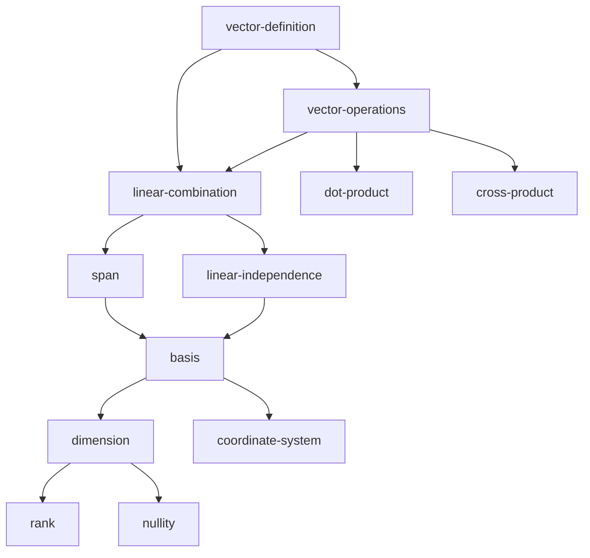

# 概念依赖图 Schema

## 核心原理

**公理**：概念之间存在依赖关系，某些概念必须先学才能理解后续概念。

**推论**：
1. 学习路径是一个有向无环图（DAG）
2. 可以通过拓扑排序计算最优学习顺序
3. 阶段划分应基于认知负荷，而非学科逻辑

---

## 文件格式

`<topic-slug>/concept-graph.md`

```yaml
---
topic: "线性代数"
created_at: "2026-04-22"
last_updated: "2026-04-22"
---

# 概念依赖图

## 元数据

- **总概念数**：25
- **总认知负荷**：78（所有概念复杂度之和）
- **预计阶段数**：5（按每阶段负荷 15 划分）

## 概念列表

### 阶段 1：向量基础

#### vector-definition
- **名称**：向量的定义
- **复杂度**：2（1-5 分，5 最复杂）
- **依赖**：[]（无前置）
- **被依赖**：[vector-operations, linear-combination]
- **是否里程碑**：false
- **学习状态**：未学习
- **跳过原因**：null

#### vector-operations
- **名称**：向量运算（加法、数乘）
- **复杂度**：3
- **依赖**：[vector-definition]
- **被依赖**：[dot-product, cross-product, linear-combination]
- **是否里程碑**：true
- **里程碑任务**：用向量表示物理问题中的力，并计算合力
- **学习状态**：未学习
- **跳过原因**：null

### 阶段 2：线性组合与空间

#### linear-combination
- **名称**：线性组合
- **复杂度**：4
- **依赖**：[vector-definition, vector-operations]
- **被依赖**：[span, linear-independence]
- **是否里程碑**：false
- **学习状态**：未学习
- **跳过原因**：null

#### span
- **名称**：张成空间
- **复杂度**：4
- **依赖**：[linear-combination]
- **被依赖**：[basis, subspace]
- **是否里程碑**：false
- **学习状态**：未学习
- **跳过原因**：null

#### linear-independence
- **名称**：线性无关
- **复杂度**：5
- **依赖**：[linear-combination]
- **被依赖**：[basis, dimension]
- **是否里程碑**：true
- **里程碑任务**：判断一组向量是否线性无关
- **学习状态**：未学习
- **跳过原因**：null

### 阶段 3：基与维数

#### basis
- **名称**：基
- **复杂度**：5
- **依赖**：[span, linear-independence]
- **被依赖**：[dimension, coordinate-system]
- **是否里程碑**：true
- **里程碑任务**：找到一个向量空间的基
- **学习状态**：未学习
- **跳过原因**：null

#### dimension
- **名称**：维数
- **复杂度**：3
- **依赖**：[basis]
- **被依赖**：[rank, nullity]
- **是否里程碑**：false
- **学习状态**：未学习
- **跳过原因**：null

## 阶段划分

### 阶段 1：向量基础
- **覆盖概念**：vector-definition, vector-operations
- **总认知负荷**：5（2+3）
- **里程碑**：用向量表示物理问题中的力
- **预计轮数**：8-12 轮（基于 standard 模式）

### 阶段 2：线性组合与空间
- **覆盖概念**：linear-combination, span, linear-independence
- **总认知负荷**：13（4+4+5）
- **里程碑**：判断一组向量是否线性无关
- **预计轮数**：15-20 轮

### 阶段 3：基与维数
- **覆盖概念**：basis, dimension
- **总认知负荷**：8（5+3）
- **里程碑**：找到一个向量空间的基
- **预计轮数**：10-15 轮

## 依赖关系图（Mermaid）



## 学习路径

### 拓扑排序结果
1. vector-definition
2. vector-operations
3. linear-combination
4. span, linear-independence（可并行）
5. basis
6. dimension, coordinate-system（可并行）
7. rank, nullity（可并行）

### 关键路径（最长依赖链）
vector-definition → vector-operations → linear-combination → linear-independence → basis → dimension → rank

**关键路径长度**：7 个概念
**关键路径负荷**：26（2+3+4+5+5+3+4）

## 动态调整记录

### 2026-04-22
- 学生在入学验证时，vector-definition 已掌握
- 标记 vector-definition 为"可跳过"
- 调整后总负荷：76（78-2）

### 2026-04-23
- 学生在 linear-combination 卡住
- 诊断：vector-operations 未真正掌握
- 插入临时复习：vector-operations（标记为"需重学"）
```

---

## 字段说明

### 概念字段

| 字段 | 类型 | 说明 |
|------|------|------|
| **名称** | string | 概念的人类可读名称 |
| **复杂度** | 1-5 | 概念的认知复杂度权重 |
| **依赖** | list[concept-id] | 前置概念列表（必须先学） |
| **被依赖** | list[concept-id] | 后续概念列表（依赖本概念） |
| **是否里程碑** | boolean | 学完后能否"做一件事" |
| **里程碑任务** | string | 具体的可操作任务（如果是里程碑） |
| **学习状态** | enum | 未学习 / 学习中 / 已掌握 / 需重学 |
| **跳过原因** | string | 如果跳过，记录原因 |

### 复杂度权重标准

| 权重 | 定义 | 示例 |
|------|------|------|
| **1** | 纯定义，无推导 | "向量是有大小和方向的量" |
| **2** | 简单定义 + 一个例子 | "向量加法：对应分量相加" |
| **3** | 需要理解一个核心洞察 | "线性组合：用系数和向量构造新向量" |
| **4** | 需要理解多个洞察，或有反直觉之处 | "张成空间：所有线性组合的集合" |
| **5** | 需要综合多个概念，或有深刻的抽象 | "基：线性无关且张成整个空间的向量组" |

### 里程碑任务标准

**好的里程碑任务**：
- 可操作（学生能独立完成）
- 可验证（导师能判断对错）
- 有意义（解决实际问题，而非纯练习）

**示例**：
- ✅ "用向量表示物理问题中的力，并计算合力"
- ✅ "判断一组向量是否线性无关"
- ✅ "找到一个向量空间的基"
- ❌ "理解向量的定义"（不可操作）
- ❌ "掌握线性组合"（不可验证）

---

## 阶段划分原则

### 原则 1：按认知负荷划分，而非按学科逻辑

**错误做法**：
```
阶段 1：向量（包含 10 个概念，总负荷 35）
阶段 2：矩阵（包含 3 个概念，总负荷 8）
→ 阶段 1 过重，学生学到一半就放弃
```

**正确做法**：
```
阶段 1：向量基础（2 个概念，总负荷 5）
阶段 2：线性组合与空间（3 个概念，总负荷 13）
阶段 3：基与维数（2 个概念，总负荷 8）
→ 每个阶段负荷相近
```

### 原则 2：每个阶段结束时有一个里程碑

**错误做法**：
```
阶段 1 结束时：学生学完了"向量的定义"
→ 学生不知道学这个有什么用
```

**正确做法**：
```
阶段 1 结束时：学生能"用向量表示物理问题中的力"
→ 学生能做一件事，有成就感
```

### 原则 3：阶段之间有自然的休息点

**错误做法**：
```
阶段 1 结束时：学到"线性组合"的一半
→ 学生暂停后，忘记了前面的内容
```

**正确做法**：
```
阶段 1 结束时：学完"线性组合"，并做了费曼复述
→ 学生暂停后，可以从下一个概念开始
```

---

## 动态调整机制

### 调整场景 1：学生已掌握某个概念

```yaml
# 入学验证时发现
vector-definition:
  学习状态: 已掌握
  跳过原因: "入学验证通过（2026-04-22）"
```

### 调整场景 2：学生在某个概念卡住

```yaml
# 教学中发现前置概念未真正掌握
vector-operations:
  学习状态: 需重学
  原因: "学生在 linear-combination 卡住，诊断为 vector-operations 未掌握"
  重学日期: "2026-04-23"
```

### 调整场景 3：概念过于复杂，需要拆分

```yaml
# 原概念
linear-independence:
  复杂度: 5
  
# 拆分后
linear-independence-definition:
  复杂度: 3
  依赖: [linear-combination]
  
linear-independence-test:
  复杂度: 2
  依赖: [linear-independence-definition]
```

---

## 生成流程

### 步骤 1：列出所有概念

从主题的知识体系中，列出所有需要学习的概念。

### 步骤 2：标注复杂度

根据复杂度权重标准，为每个概念打分（1-5）。

### 步骤 3：标注依赖关系

对于每个概念，问：
- "学这个概念之前，必须先学什么？"（前置依赖）
- "学完这个概念后，可以学什么？"（后续依赖）

### 步骤 4：检查循环依赖

使用拓扑排序算法，检查是否存在循环依赖：
```python
if 存在循环依赖:
    报错："概念依赖图存在循环，请检查"
```

### 步骤 5：标注里程碑

对于每个阶段，至少标注一个"里程碑概念"，并定义里程碑任务。

### 步骤 6：计算阶段划分

```python
MAX_LOAD_PER_STAGE = 15  # 根据学生吞吐率调整

stages = []
current_stage = []
current_load = 0

for concept in topological_order:
    if current_load + concept.complexity > MAX_LOAD_PER_STAGE:
        # 检查当前阶段是否有里程碑
        if not any(c.is_milestone for c in current_stage):
            # 调整：把下一个里程碑概念拉进来
            pass
        
        stages.append(current_stage)
        current_stage = [concept]
        current_load = concept.complexity
    else:
        current_stage.append(concept)
        current_load += concept.complexity
```

---

## 与 2.x 版本的区别

| 维度 | 2.x | 3.0 |
|------|-----|-----|
| 路径规划 | 导师凭经验划分阶段 | 构建 DAG + 拓扑排序 |
| 阶段划分 | 按学科逻辑 | 按认知负荷 |
| 里程碑 | 无明确定义 | 每阶段有可操作任务 |
| 动态调整 | 无机制 | 可标记"需重学"/"可跳过" |
| 依赖关系 | 隐式（导师心中） | 显式（写入文件） |
