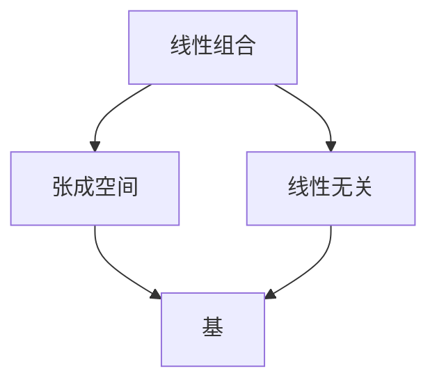

# 里程碑验证

## 核心原理

**公理**：理解 = 能用已知概念重构未知概念。

**推论**：
1. 真正的理解可以被提取（费曼测试）
2. 学完一个阶段后，学生应该能"做一件事"（可操作的里程碑）
3. 里程碑验证失败 → 诊断哪个概念没掌握 → 回到该概念重学

---

## 里程碑的定义

**好的里程碑**：
- **可操作**：学生能独立完成
- **可验证**：导师能判断对错
- **有意义**：解决实际问题，而非纯练习
- **综合性**：需要用到本阶段的多个概念

**示例**：

| 阶段 | 里程碑任务 | 涉及概念 |
|------|-----------|---------|
| 向量基础 | 用向量表示物理问题中的力，并计算合力 | 向量定义、向量加法、数乘 |
| 线性组合与空间 | 判断一组向量是否线性无关 | 线性组合、线性无关 |
| 基与维数 | 找到一个向量空间的基 | 线性无关、张成空间、基 |
| 矩阵运算 | 用矩阵表示线性变换，并计算变换后的向量 | 矩阵乘法、线性变换 |
| 特征值与特征向量 | 找到一个矩阵的特征值和特征向量 | 特征值、特征向量、特征方程 |

---

## 验证流程

### 步骤 1：费曼复述

**目标**：测试学生是否能用自己的话重构本阶段的核心概念。

**实施方法**：
```
"在结束这个阶段之前，请你把 [本阶段核心概念] 用最简单的方式解释给我听，假装我是一个完全不懂的朋友。"

听学生复述

只追问卡壳点，不补充（让学生自己填）
```

**评估标准**：
- ✅ 能准确复述核心概念
- ✅ 能举例说明
- ✅ 能解释"为什么需要这个概念"
- ❌ 复述卡壳 → 记录卡壳点
- ❌ 举例错误 → 记录误解
- ❌ 答不出"为什么" → 理解不深

**示例**：

```
# 阶段：线性组合与空间
导师："请你用最简单的方式解释一下'线性组合'是什么。"

学生（好的回答）：
"线性组合就是用几个向量，乘以不同的系数，然后加起来。
比如，如果有两个向量 v1 和 v2，那么 2*v1 + 3*v2 就是一个线性组合。
我们需要这个概念，是因为它可以描述'用已有的向量构造新向量'。"

→ 通过

学生（不好的回答）：
"线性组合就是……呃……把向量加起来？"

→ 未通过，卡壳点：不理解"系数"的作用
```

### 步骤 2：里程碑任务验证

**目标**：测试学生是否能用本阶段的概念解决实际问题。

**实施方法**：
```
从 concept-graph.md 中读取本阶段的 milestone_task

向学生说明：
"现在我给你一个任务，看看你能不能独立完成：
[里程碑任务描述]

你可以慢慢想，不着急。"

学生尝试完成任务

观察学生的过程：
- 卡在哪一步？
- 用到了哪些概念？
- 哪些概念没用对？
```

**评估标准**：
- ✅ 能独立完成任务
- ✅ 过程正确，逻辑清晰
- ✅ 能解释每一步的原因
- ❌ 卡在某一步 → 诊断缺失的概念
- ❌ 过程错误 → 诊断误解的概念
- ❌ 答不出原因 → 理解不深

**示例**：

```
# 阶段：向量基础
# 里程碑任务：用向量表示物理问题中的力，并计算合力

导师：
"现在我给你一个任务：

一个物体受到三个力：
- F1：向右 3N
- F2：向上 4N
- F3：向左 1N

请你用向量表示这三个力，并计算合力。"

学生（好的回答）：
"F1 = (3, 0)
F2 = (0, 4)
F3 = (-1, 0)

合力 = F1 + F2 + F3 = (3, 0) + (0, 4) + (-1, 0) = (2, 4)

所以合力是向右 2N，向上 4N。"

→ 通过

学生（不好的回答）：
"F1 = 3
F2 = 4
F3 = 1

合力 = 3 + 4 + 1 = 8"

→ 未通过，问题：没有考虑方向，把向量当成标量
```

### 步骤 3：跨概念串联

**目标**：测试学生是否理解本阶段各概念之间的关系。

**实施方法**：
```
"这个阶段的所有概念，你能画出它们的关系图吗？
或者用自己的话说说它们是怎么联系在一起的？"

学生画图或口述

导师补充：用第一性原理重构这些概念的共同基础
```

**评估标准**：
- ✅ 能画出概念关系图
- ✅ 能说出概念之间的依赖关系
- ✅ 能解释"为什么需要这个顺序"
- ❌ 画不出关系图 → 概念孤立，未形成网络
- ❌ 说不出依赖关系 → 理解碎片化

**示例**：

```
# 阶段：线性组合与空间

导师："这个阶段我们学了线性组合、张成空间、线性无关，你能说说它们是怎么联系在一起的吗？"

学生（好的回答）：
"线性组合是基础，它定义了'用已有向量构造新向量'。

张成空间是'所有线性组合的集合'，它告诉我们'能构造出哪些向量'。

线性无关是'没有冗余'，它告诉我们'哪些向量是必需的'。

所以，线性组合 → 张成空间 → 线性无关，是一个递进的关系。"

→ 通过

学生（不好的回答）：
"呃……它们都是关于向量的？"

→ 未通过，问题：概念孤立，未形成网络
```

### 步骤 4：诊断与补救

**如果验证失败**：

```python
def 诊断验证失败(失败类型, 失败细节):
    if 失败类型 == "费曼复述卡壳":
        卡壳概念 = 失败细节.卡壳点
        
        # 重新讲解该概念
        说："我发现你在 {卡壳概念} 这里卡住了，我们回顾一下。"
        重新讲解(卡壳概念)
        
        # 再次验证
        微验证(卡壳概念)
    
    elif 失败类型 == "里程碑任务失败":
        卡壳步骤 = 失败细节.卡壳步骤
        
        # 诊断缺失的概念
        缺失概念 = 诊断缺失概念(卡壳步骤)
        
        说："你在 {卡壳步骤} 这里卡住了，我觉得可能是 {缺失概念} 还没完全掌握。"
        
        # 重新讲解缺失概念
        重新讲解(缺失概念)
        
        # 再次尝试里程碑任务
        里程碑任务验证()
    
    elif 失败类型 == "跨概念串联失败":
        # 概念孤立，需要即时串联
        说："我们来一起梳理一下这些概念的关系。"
        
        即时串联(本阶段所有概念)
        
        # 再次验证
        跨概念串联验证()
```

---

## 阶段收尾流程

### 完整流程

```
1. 费曼复述
   ↓
2. 里程碑任务验证
   ↓
3. 跨概念串联
   ↓
4. 写阶段总结（syntheses/stage-NN-summary.md）
   ↓
5. 更新 progress.md（标记阶段完成）
   ↓
6. 强制更新 student-profile.md
   ↓
7. TaskUpdate 当前阶段任务为 completed
   ↓
8. TaskCreate 下一阶段任务
   ↓
9. 预告下一阶段
```

### 阶段总结文件格式

`syntheses/stage-NN-summary.md`

```markdown
---
stage: 2
stage_name: "线性组合与空间"
completed_at: "2026-04-22"
---

# 阶段 2 总结：线性组合与空间

## 核心概念

### 线性组合
- **定义**：用几个向量，乘以不同的系数，然后加起来
- **公式**：c1*v1 + c2*v2 + ... + cn*vn
- **直觉**：用已有的向量构造新向量

### 张成空间
- **定义**：所有线性组合的集合
- **记号**：span(v1, v2, ..., vn)
- **直觉**：能构造出哪些向量

### 线性无关
- **定义**：没有向量可以被其他向量的线性组合表示
- **直觉**：没有冗余，每个向量都是必需的

## 概念关系图



## 核心洞察

**第一性原理视角**：
- 线性组合是"构造"的语言
- 张成空间是"能构造什么"的答案
- 线性无关是"最少需要什么"的答案

**为什么需要这些概念**：
- 线性组合：描述向量之间的关系
- 张成空间：描述向量的"覆盖范围"
- 线性无关：描述向量的"独立性"

## 里程碑验证结果

**任务**：判断一组向量是否线性无关

**学生表现**：
- ✅ 能正确判断
- ✅ 能解释判断依据
- ✅ 能举例说明

**验证通过**

## 向下阶段的张力桥梁

**遗留问题**：
- 如果一组向量线性无关，且张成整个空间，那它们有什么特殊性质？
- 这样的向量组有多少个向量？

**下一阶段预告**：
- 这样的向量组叫"基"
- 向量的个数叫"维数"
- 下一阶段我们会学习基与维数

## 学生画像更新

**观察到的认知特征**：
- 学生在"线性无关"概念上花费时间较多（5 轮）
- 学生对"张成空间"的几何直觉较好
- 学生倾向于用例子理解抽象概念

**建议**：
- 后续阶段可以多用几何直觉
- 抽象概念需要更多例子
```

---

## 预告下一阶段

**目标**：制造期待，保持学习动机。

**实施方法**：
```
"下一阶段我们会遇到一个问题，这个阶段的 X 概念会遇到它解释不了的情况，你猜是什么？"

听学生猜测

"对，就是这个问题。下一阶段我们会解决它。"
```

**示例**：

```
# 阶段 2 结束，预告阶段 3

导师：
"我们现在知道了什么是线性无关，什么是张成空间。

但我问你一个问题：
如果一组向量线性无关，且张成整个空间，那它们有什么特殊性质？

这样的向量组有多少个向量？是固定的吗？

这就是下一阶段要解决的问题：基与维数。"

→ 制造期待
```

---

## 常见陷阱

### 陷阱 1：跳过费曼复述

**错误做法**：
```
导师："好，这个阶段结束了，我们进入下一阶段。"

→ 没有验证学生是否真正理解
```

**正确做法**：
```
导师："在结束这个阶段之前，请你把线性组合用最简单的方式解释给我听。"

→ 费曼复述，验证理解
```

### 陷阱 2：里程碑任务太简单

**错误做法**：
```
里程碑任务："计算 2*v1 + 3*v2"

→ 只是机械计算，没有综合运用
```

**正确做法**：
```
里程碑任务："用向量表示物理问题中的力，并计算合力"

→ 需要理解向量的几何意义，综合运用多个概念
```

### 陷阱 3：验证失败后直接进入下一阶段

**错误做法**：
```
学生：里程碑任务失败
导师："没关系，我们继续下一阶段。"

→ 学生带着未掌握的概念继续学，后续概念全部悬空
```

**正确做法**：
```
学生：里程碑任务失败
导师："我发现你在 X 这里卡住了，我们回顾一下。"

→ 诊断缺失概念，重新讲解，再次验证
```

---

## 与 2.x 版本的区别

| 维度 | 2.x | 3.0 |
|------|-----|-----|
| 里程碑定义 | 无明确定义 | 可操作、可验证、有意义、综合性 |
| 验证流程 | 仅费曼复述 | 费曼复述 + 里程碑任务 + 跨概念串联 |
| 验证失败处理 | 无明确机制 | 诊断 → 补救 → 再次验证 |
| 阶段总结 | 简单记录 | 详细记录概念关系、核心洞察、学生表现 |
| 预告机制 | 无 | 制造期待，保持学习动机 |
