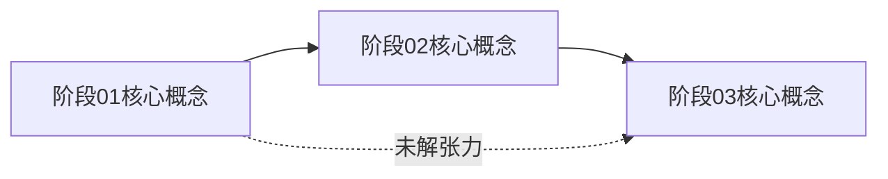

# 大纲与阶段文件 Schema

本文件定义 Master skill 产物文件的格式规范，并附一份完整示例（以「线性代数入门」为参考）。

---

## 一、`outline.md` — 宏观学习大纲

### Frontmatter

```yaml
---
topic: <主题名，人类可读>
topic_slug: <连字符小写，用于目录命名>
goal: <一句话学习目标：学完之后能做什么 / 理解什么>
prerequisites: <前置知识清单，无则写 none>
philosophy: <本主题的第一性命题：这个领域最根本的直觉是什么？>
created_at: <YYYY-MM-DD>
estimated_stages: <预计阶段数量>
current_stage: <当前所在阶段编号，从 1 开始>
---
```

### Body 结构

```markdown
## 核心驱动问题
<一个本主题结束时才能完整回答的大问题，贯穿始终>

## 学习大纲

| 编号 | 阶段主题 | 教学目标（Bloom 动词）| 核心驱动问题 | 前置阶段 | 向下一阶段的张力点 |
|---|---|---|---|---|---|
| 01 | ... | 能「解释 / 推导 / 构建 / 评价」... | ... | none | ... |
| 02 | ... | 能「...」... | ... | 01 | ... |
| NN | ... | ... | ... | ... | ... |

## 第一性原理溯源
<用 2-3 句话，描述这个主题的最底层公理或直觉。为什么这个领域存在？它解决了什么根本问题？>
```

---

## 二、`stages/stage-NN-<slug>.md` — 阶段知识图谱

### Frontmatter

```yaml
---
stage: <阶段编号，如 01>
stage_name: <阶段标题>
status: not_started | in_progress | done
pace_mode: slow | standard | fast | adaptive
opened_at: <YYYY-MM-DD>
completed_at: <YYYY-MM-DD 或 null>
---
```

### Body 结构

```markdown
## 知识图谱

<用缩进树或 Mermaid 图展示本阶段的概念依赖关系>

## 驱动问题列表
<按难度/深度排列，Master 在教学过程中逐步抛出这些问题>
1. [入门] ...
2. [核心] ...
3. [深化] ...
4. [挑战] ...

## 脚手架问题（slow 学生专用，可选）
<当学生在「入门」级问题上卡住时，切换到这里。比入门级更细、嵌入更具体的情境，降低抽象度>
1. [具体情境] ...
（如无需要可省略此节）

## 关键易混淆点
<学生容易混淆的概念对，Master 需要特别留意>
- X vs Y：...

## 费曼检查点
<本阶段费曼复述的目标要求：学生应能做到什么>
- 能用自己的语言解释...
- 能给出一个例子说明...
- 能说出「如果没有这个概念，会缺少什么」

## 延伸（选读）
<对 fast 学生的扩展方向，不进入考核范围>
```

---

## 三、`progress.md` — 当前进度指针

```markdown
---
active_topic: <topic-slug>
current_stage: <当前阶段编号>
last_session_at: <YYYY-MM-DD>
---

## 会话日志

| 日期 | 阶段 | 本次进展 | 下次从何开始 |
|---|---|---|---|
| YYYY-MM-DD | stage-01 | 完成了 X 的引导，学生能推导出 Y | 从费曼复述开始 |
```

---

## 四、`syntheses/stage-NN-summary.md` — 阶段串联总结

```markdown
---
type: stage_summary | cross_stage
covers: [stage-01, stage-02]  # 本次总结覆盖的阶段
created_at: YYYY-MM-DD
---

## 本阶段脉络（或跨阶段脉络）

<用 Mermaid 图或概念树展示知识点之间的关系>

## 核心概念串联
<显式写出「A → B → C」的逻辑链，说明为什么这些概念按这个顺序出现>

## 旧知到新知的桥梁
<明确写：「阶段 N 的 X 概念，是为了应对阶段 N 里 Y 无法解决的情况」>

## 留给下一阶段的张力
<本总结结尾必须有一个开放问题，引出下一阶段>
```

**当 `type: cross_stage` 时，额外强制包含以下两节：**

```markdown
## 跨阶段概念网
<必须有 Mermaid 图，节点覆盖所有被综述阶段的核心概念，边表示「依赖」或「张力」关系>



## 张力演化序列
阶段 01 留下的未解张力：[...]
→ 阶段 02 如何接住并部分解决：[...]
→ 阶段 03 如何进一步推进或引出新张力：[...]
（显式写出问题在跨阶段中的迁移与演化，而不只是概念罗列）
```

---

## 五、完整示例：线性代数入门

> **⚠️ 本例仅用于演示 schema 的填写方式，不是可套用的模板。**
> 所有字段（阶段划分、philosophy、驱动问题）都必须基于当前主题从零重新设计。不要把这个示例的「5 阶段结构」或「第一性命题」的写法照搬到其他主题——文学、哲学、音乐、历史各有各的骨架，需要 Master 基于第一性原理重新推导，而不是套模子。

### `<cwd>/linear-algebra/outline.md`

```markdown
---
topic: 线性代数入门
topic_slug: linear-algebra
goal: 能够用矩阵与线性变换的视角理解并手算基础计算，同时建立几何直觉
prerequisites: 高中代数、基础函数概念
philosophy: 线性代数的本质是「在保持结构不变的前提下，研究如何描述、分类和转换空间」。「线性」意味着叠加原理成立。
created_at: 2026-04-17
estimated_stages: 5
current_stage: 1
---

## 核心驱动问题
为什么一组联立方程有时候有唯一解，有时候有无穷解，有时候无解？这背后是什么几何现实？

## 学习大纲

| 编号 | 阶段主题 | 教学目标 | 核心驱动问题 | 前置阶段 | 向下一阶段的张力点 |
|---|---|---|---|---|---|
| 01 | 向量与几何直觉 | 能用几何方式解释向量加法与数乘 | 「数」和「方向」为什么可以合在一起？ | none | 用箭头描述运动太繁琐，能否用数字压缩？ |
| 02 | 矩阵与线性变换 | 能解释矩阵乘法为何是变换的复合 | 矩阵只是一堆数吗？还是它在「做」什么？ | 01 | 某些变换后信息丢失，是什么丢了？ |
| 03 | 线性方程组与行化简 | 能手动 Gauss 消元并理解其几何含义 | 解方程组和找两平面交线是同一件事吗？ | 02 | 为什么有些方程组的解「太多」？ |
| 04 | 行列式与体积 | 能解释行列式为什么衡量「体积缩放比」 | 行列式为 0 时发生了什么？ | 03 | 缩放中有没有「不变量」？ |
| 05 | 特征值与特征向量 | 能识别哪些方向在变换下只发生缩放 | 有没有某个方向，变换后还是指向同一方向？ | 04 | — |

## 第一性原理溯源
线性代数来自「如何系统解多元一次方程组」这个古老需求。其核心发现是：这些方程的解集有强烈的几何结构——它们是「平坦的」空间（点、线、面、超平面）。一旦接受「线性」（叠加原理），整个理论的形式就几乎是唯一确定的。
```

### `<cwd>/linear-algebra/stages/stage-01-vectors.md`（片段）

```markdown
---
stage: "01"
stage_name: 向量与几何直觉
status: in_progress
pace_mode: adaptive
opened_at: 2026-04-17
completed_at: null
---

## 知识图谱

向量
├── 几何表示（有向线段）
├── 代数表示（坐标列）
├── 向量加法
│   ├── 几何：首尾相接
│   └── 代数：分量相加
├── 数乘（伸缩）
└── 零向量与方向的特殊性

## 驱动问题列表
1. [入门] 「3 向东走，4 向北走」最终在哪里？能不能用一个数表示？
2. [核心] 向量加法的两种定义（首尾相接 vs 平行四边形）是同一件事吗？为什么？
3. [深化] 如果我告诉你「1 个单位向东 + 1 个单位向北 = 斜走 √2」，这里的「加法」和数字加法本质上有什么不同？
4. [挑战] 能不能定义一种「向量乘法」使得它在几何上有意义？尝试一下，你会遇到什么困难？
```
